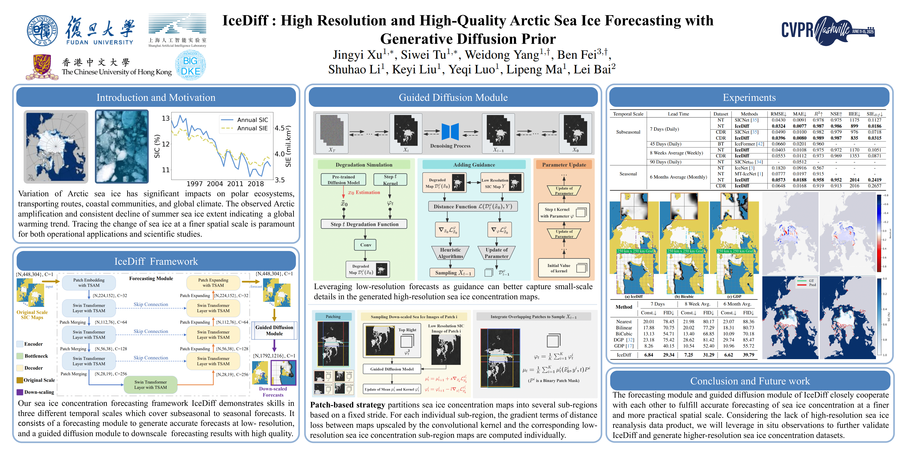

# Stage-1: IceDiff-FM
A U-Net architecture forecasting model for predict sea ice concentration at 7 days, 8 weeks average and 6 months average.

## Data Processing
(a)Download G02202 Version 4 data from NSIDC website.
(b)Configure downloaded .nc file (North Pole, including daily sea ice concentration and  G02202-cdr-ancillary-nh.nc file).
(c)Install netCDF4 package (we use version 1.6.3 to read .nc file):
```
pip install netCDF4
```
(d)For generating datasets, using commands
```
python /ForecastingModule/Data/preprocess_sic.py --gen_mask=1 --gen_daily=1 --config_file='/Model/config_days.yaml'
```
```
python /ForecastingModule/Data/preprocess_sic.py --config_file='/Model/config_weeks.yaml'
```
```
python /ForecastingModule/Data/preprocess_sic.py --config_file='/Model/config_months.yaml'
```

## Model Training
Initiate training script using following commands
```
python /ForecastingModule/train_FM_days.py --gpu_rank=0 --config_file='/Model/config_days.yaml'
```
```
python /ForecastingModule/train_FM_weeks.py --gpu_rank=0 --config_file='/Model/config_weeks.yaml'
```
```
python /ForecastingModule/train_FM_months.py --gpu_rank=0 --config_file='/Model/config_months.yaml'
```


# Stage-2: IceDiff-GDM
An unconditional diffusion model IceDiff-GDM pre-trained on sea ice concentration maps is utilized for sampling down-scaled sea ice forecasting via a zero-shot guided sampling strategy and a patch-based method (model code in `/GuidedDiffusionModule/guided_diffusion/unet.py/UNetModel`).

## Data Processing
Convert official SIC data (/Sample_SIC/seaice_conc_daily_nh_20231231_f17_v04r00.nc) or low resolution results generated from trained forecasting module (both have resolution of 448 x 304) to npz file, with dimensions: data arr_0 `[B,H,W,C]`, label arr_1 `[B]` (see class NpzDataset).


## Guided Down-scaling

```
python downscale.py 
--save_dir [Path of the folder used to store output results.]
--base_samples [Path of the preprocessed npz file of the SIC maps.]
--model_path [Path of pre-trained UNet model.]
--scale [Designate down-scaling ratio.]
```

